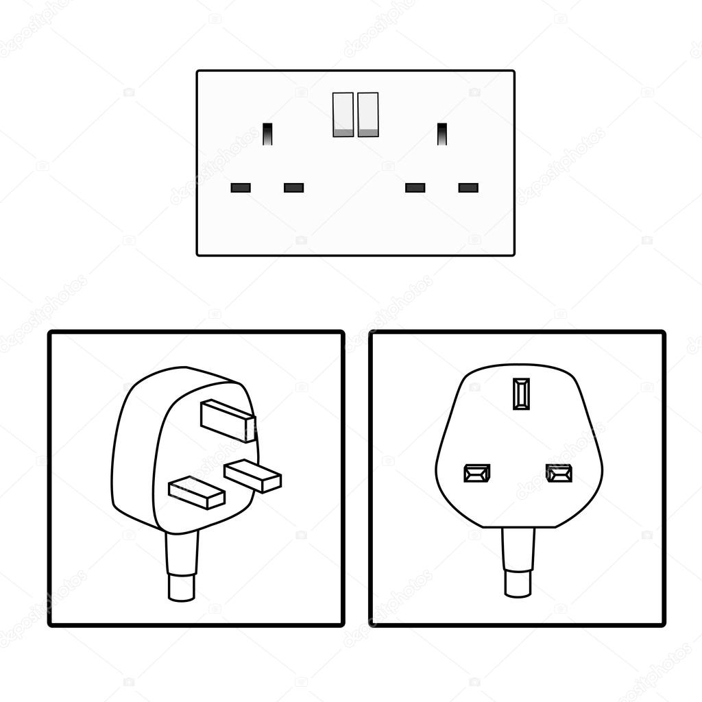

 

The "**Computational Modeling in Biology**" Network (**COMBINE**) is an initiative to coordinate the development of the various community standards and formats in systems biology, synthetic biology and related fields. **COMBINE 2026** will be a workshop-style event hosted at Keele University, UK.

Local organisers are <a href="mailto:g.misirli@keele.ac.uk">Goksel Misirli</a>, <a href="mailto:m.unal@keele.ac.uk">Metehan Unal</a>, and Roberto Galizi. 

<h3>Confirmed Invited Speakers</h3>

  * Geoff Baldwin, Centre for Engineering Biology, Imperial College, UK
  * Rahuman Sheriff, European Bioinformatics Institute, European Molecular Biology Laboratory (EMBL-EBI), UK
  * Gary Mirams, Centre for Mathematical Medicine & Biology, University of Nottingham, UK

<h3>Workshop Location</h3>
COMBINE 2026 will take place at <a href="https://www.keele.ac.uk/">Keele University</a> in Newcastle under Lyme, Staffordshire, ST5 5NS, United Kingdom. The conference will be held at the <a href="https://keele-conference.com/venue/denise-coates-foundation-building-keele-campus/">Smart Innovation Hub</a> (also known as Innovation Centre 6).
  
The Think Lab (LG0.31) will be used as the main room on the lower ground floor. Please see the <a href="https://keele-conference.com/wp-content/uploads/2023/03/Denise-Coates-Foundation-Building-Floor-Plan.pdf">floor plan</a>. A lift is available from the upper ground floor. The lower ground floor also has direct access from outside. Please contact us should you require assistance prior to your arrival. 
  
In addition to the main room, three breakout rooms will be available after 12:00. All of the rooms are located on the lower ground floor.

  * Open Innovation - LG.035 (up to 34 people)
  * Executive Boardroom - LG.035 (up to 20 people)
  * Boardroom - LG.036 (up to 14 people)

<h3>Schedule</h3>

The schedule will be available here.
   

<h4>Posters</h4>
The posters will be displayed on Monday, 7 Sep. A0 poster boards will be available in the <a href="https://keele-conference.com/room/atrium-at-denise-coates-building/">Atrium</a>. Please make sure to submit your poster abstracts.

<h4>COMBINE Dinner</h4>
The registration also includes a three course banquet dinner, which will be on Monday at 19:00 and held in <a href="https://keele-conference.com/room/the-salvin-room-at-keele-hall/">Salvin Room</a> at <a href="https://keele-conference.com/venues-conference-space-in-staffordshire/keele-hall-small-meetings-at-keele/">Keele Hall</a> (number 15 on <a href="https://keele-conference.com/wp-content/uploads/2021/06/Denise-Coates-Foundation-Building-Information-Sheet.pdf">the Keele campus map on page 3</a>). Please advise the organisers if you have any allergies, intolerances or special dietary requirements, using the registration form.

<h3>Arrival and Transportation</h3>
Please see <a href="https://keele-conference.com/wp-content/uploads/2021/06/Denise-Coates-Foundation-Building-Information-Sheet.pdf">the Delegate Information Sheet on page 2 </a> for travelling to Keele. You will find information about the nearby airports, and getting to Keele by rail or car. 
  
Additional information can be found at: 
<a href="https://keele-conference.com/delegates-visitors-how-to-get-to-keele/">https://keele-conference.com/delegates-visitors-how-to-get-to-keele/</a>
  
The venue, Smart Innovation Hub, is marked as number 51 (close to the main university entrance) on <a href="https://keele-conference.com/wp-content/uploads/2021/06/Denise-Coates-Foundation-Building-Information-Sheet.pdf">the Keele campus map on page 3</a>. The postcode for the building is ST5 5NS. 
 
<h4>Parking</h4>
For those who plan to arrive by car, please see the <a href="https://keele-conference.com/wp-content/uploads/2021/06/Denise-Coates-Foundation-Building-Information-Sheet.pdf">car parking section on page 1</a>. You must register your car prior to arrival at Keele. We will share a link for you to register your details closer to the event. If you have any questions, please contact the organisers.
  
Once registered, car parking is available in <a href="https://maps.app.goo.gl/mTNGsdeyREVucvxq6">Plot 7 </a>, also known as A3 (see <a href="https://keele-conference.com/wp-content/uploads/2021/06/Denise-Coates-Foundation-Building-Information-Sheet.pdf">page 3 on the Delegate Information Sheet</a>).

<h3>Accommodation</h3>
Some accommodation options are listed below. There are several other options available in Newcastle-under-Lyme and Stoke-on-Trent. Some of the nearby hotels:

*  <a href="https://app.marriott.com/reslink?id=1762349504837&key=GRP&app=resvlink">Courtyard by Marriott Keele Staffordshire</a>: The hotel is on campus and just opposite the venue. 95.00 GBP per night if you book using <a href="https://app.marriott.com/reslink?id=1762349504837&key=GRP&app=resvlink"> this link</a>. This rate is valid for reservations between 6 and 10 September 2026. Number 45 (close to the main university entrance) on <a href="https://keele-conference.com/wp-content/uploads/2021/06/Denise-Coates-Foundation-Building-Information-Sheet.pdf">the Keele campus map on page 3</a>.
* <a href="https://www.ihg.com/holidayinn/hotels/gb/en/newcastle-under-lyme/xwhsf/hoteldetail">Holiday Inn - Newcastle under Lyme</a>
*  <a href="https://www.travelodge.co.uk/hotels/424/Newcastle-Under-Lyme-Central-hotel">Travelodge - Newcastle under Lyme</a>
* There are also other options, such as Premier Inn and Hilton.

<h3>Meals</h4>
The registration includes a two-course buffet lunch, which will be in the <a href="https://keele-conference.com/room/atrium-at-denise-coates-building/">Atrium</a> on the lower ground floor. Please advise the organisers if you have any allergies, intolerances, or special dietary requirements using the registration form. Tea and coffee will also be provided during the breaks. 
  
There is also a small cafe on the lower ground floor, which offers a selection of teas, coffees, breakfast, lunch, snacks, and sweet treats.
  
For more options, please see below: 

https://www.keele.ac.uk/study/student-life/campuscommunity/food-and-drink/restaurantsbarsandcafes/

https://www.keele.ac.uk/study/student-life/campuscommunity/food-and-drink/shopsandvending/

<h3>Power outlet</h3>

[G-type](https://www.endesa.com/en/blogs/endesa-s-blog/light/types-plugs-travel#:~:text=G%2Dtype%20plugs%2C%20the%20most,a%20triangular%20or%20t%20position.) plugs are used in the UK.

<h3>Support</h3>
This event is supported by BBSRC (BB/Z517367/1) and the School of Computer Science and Mathematics, Keele University.

 

